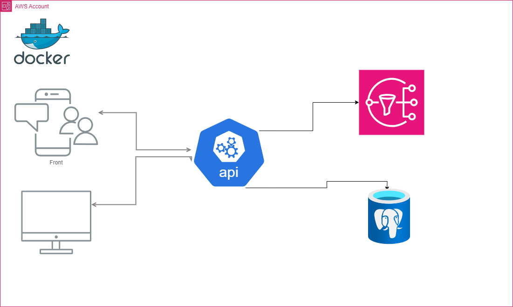

<div align="center">


</div>

<div align="center">

# DESAFIO ITAÚ - CRUD ITAU BANK SPRING BOOT - Java
O projeto tem por objetivo a realização do crud de clientes, contas e realizar tranferencia entre as contas.


</div> 

## Contexto

> API da criação de multi contas digitais de um usuario da categoria PF (pessoa física). 
  O desafio é considerado pronto quando a partir de  chamadas ao endpoint da aplicação seja possivel:
> - Cadastra clientes (Pessoa Fisica)
> - Listar clientes cadastrados
> - Cadastrar contas ára um cliente
> - Listar as contas de um cliente
> - Realizar Deposito e Retirada através de Transferencia
>.

## Tecnologias
- Java 17
- Spring Boot 3.2.3.RELEASE
- Docker
- Lombok
- Local Stack
- SNS
- postgres
- Tomcat (Embedded no Spring Boot)
- OpenApi

## 🖼 Arquitetura macro da Aplicação

<br>

<br>

## Execução

Para executar o projeto é necessario rodar o docker compose.
A execução daa aplicação pode ser feita através de um comando maven que invoca a inicialização do Spring Boot ou via IDE.

### Executar a aplicação
- 1° comando: ```docker-compose up```
- 2° Passo: ``` rodar sua aplicação via IDE ou linha de comando```


### Endereços importantes
- H2: ```http://localhost:8080/h2-console````
- Swagger: ```http://localhost:8080/swagger-ui/index.html```

## Utilização
- Collection para teste via Insomnia

### Teste via Curl

- POST CREATE CUSTOMER
````
curl --request POST \
  --url http://localhost:8080/api/v1/customers \
  --header 'Content-Type: application/json' \
  --header 'User-Agent: insomnia/8.6.1' \
  --data '{
	"name": "Mateus Araujo Barros",
	"cpf": "06104642307",
	"email": "mateus@gmail.com"
}'
````

- GET CUSTOMERBYID, GETALL, FINDALLMYACCOUNTS

```
curl --request GET \
  --url http://localhost:8080/api/v1/customers/1 \
  --header 'User-Agent: insomnia/8.6.1'
```
```
curl --request GET \
  --url http://localhost:8080/api/v1/customers \
  --header 'User-Agent: insomnia/8.6.1'
```
```
curl --request GET \
  --url http://localhost:8080/api/v1/customers/1/accounts \
  --header 'User-Agent: insomnia/8.6.1'
```

- PUT UPDATE

````
curl --request PUT \
  --url http://localhost:8080/api/v1/customers/2 \
  --header 'Content-Type: application/json' \
  --header 'User-Agent: insomnia/8.6.1' \
  --data '{
	"name": "Samuel Araújo Barros",
	"cpf": "06104642306",
	"email": "samuel@gmail.com"
}'
````

- DELETE
````
curl --request DELETE \
  --url http://localhost:8080/api/v1/customers/1 \
  --header 'User-Agent: insomnia/8.6.1'
````

- POST CREATE ACCOUNT
```
curl --request POST \
  --url http://localhost:8080/api/v1/accounts \
  --header 'Content-Type: application/json' \
  --header 'User-Agent: insomnia/8.6.1' \
  --data '{
    "idCustomer": 1,
    "accountType": "SAVINGS_ACCOUNT",
    "numberAccount": "123456791",
    "balance": 300
}'
```

- POST TRANSFER
```
curl --request POST \
  --url http://localhost:8080/api/v1/transfer \
  --header 'Content-Type: application/json' \
  --header 'User-Agent: insomnia/8.6.1' \
  --data '{
	"sourceAccountNumber": "123456791",
	"targetAccountNumber":"123456792",
	"amount": 250
}'
```


 
